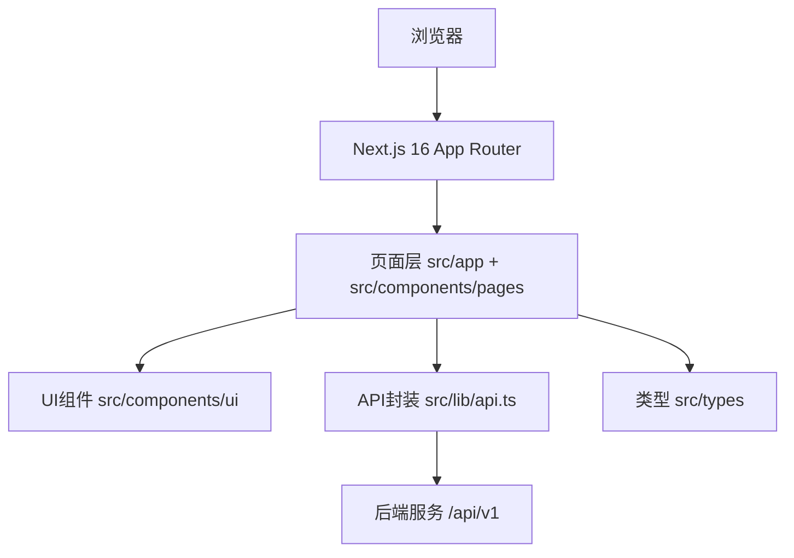

# 架构设计

## 总体架构

## 技术栈
- **前端:** Next.js 16 / React 19 / TypeScript
- **样式与组件:** Tailwind CSS / Radix UI（封装为自定义组件）
- **部署:** 静态导出（`next build` 生成静态产物，由 Nginx 托管）

## 重大架构决策
当前无新增 ADR。若引入新的状态管理、权限体系或请求层重构，将在后续变更中补充 ADR。

